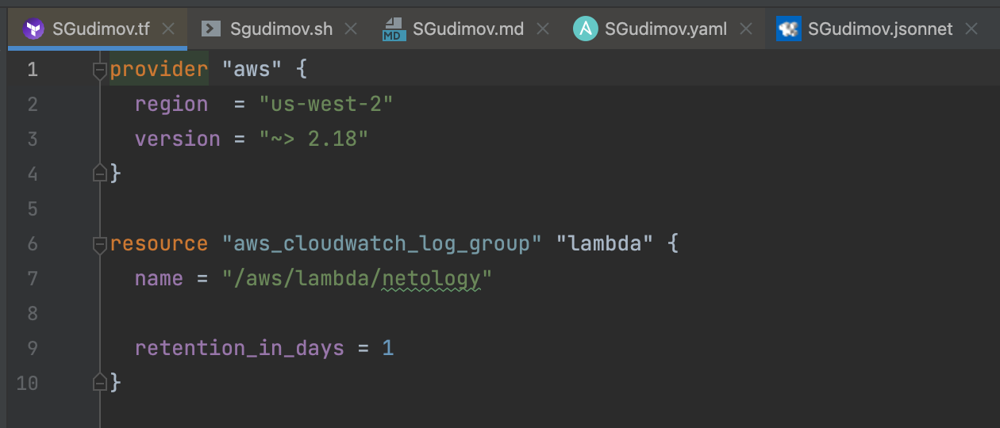
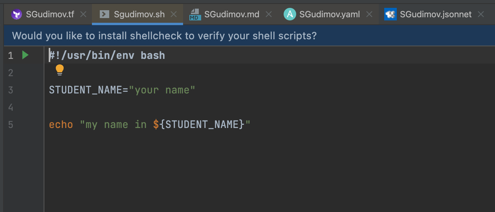
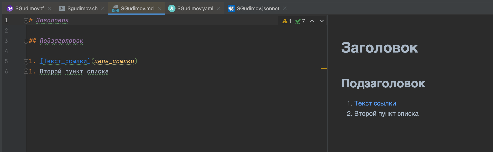
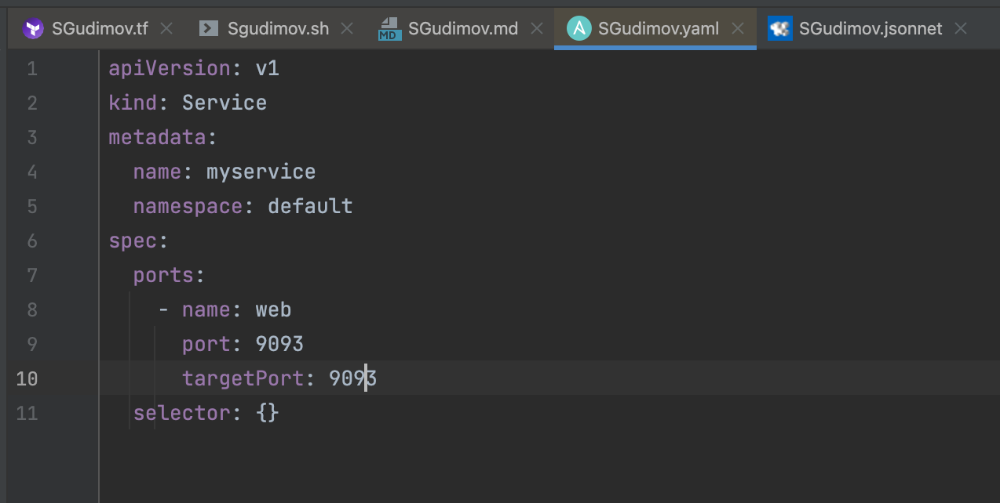
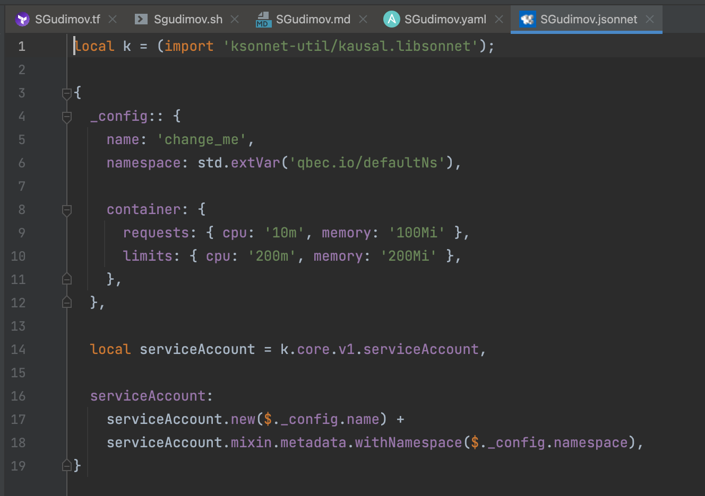

1. Задание 1
   - Terraform: 
   - Bash: 
   - Markdown: 
   - Yaml/Ansible: 
   - Jsonnet: 
2. Задание 2.
Процесс решения задачи в соответствии с жизненным циклом разработки программного обеспечения: менеджер расставляет приоритеты по задачам, выбирается задача для решения. Разработка пишет код по этой задаче, devops помогает с dev окружением, если таковое нужно. тестирование готовит тесты для проверки нового функционала. devops готовит stage окружение на котором будут проверки. разработка заканчивает с кодом и коммитит в отдельную ветку изменения. закоммиченный код приезжает на stage. пробегаются автотесты, чтобы убедиться что новый код не сломал вообще все. тестировщик проверяет функционал. если все ок после апрува от менеджера код коммитится в мастер ветку и измеения приезжает на прод. клиент пользуется новым функционалом. если что-то то не так - происходит откат измеений - код откатывается на предыдущий коммит. 