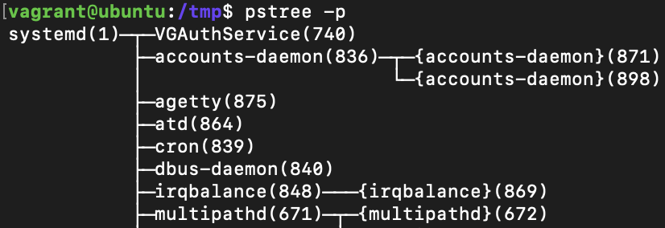

1 \
`vagrant@ubuntu:~$ type cd`
cd is a shell builtin \
 команда cd встроенна в оболочку \
вполне логично, что выполняясь, команда cd в пределах этой же сессии меняет указать на директорию, записывая значение в переменную окружения PWD \
видно как она меняется если посмотреть значение через `echo $PWD` или `env`

2 \
Без pipe посчитать кол-во вхождений строки в файле можно вызвав grep c ключом -c или --count

3 \
pstree -p \
ответ systemd \

