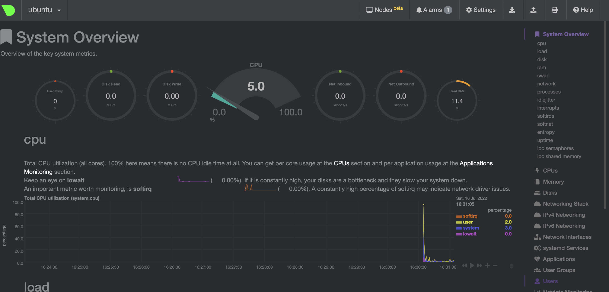

1 \

качаем node_exporter, распаковываем, копируем бинарник, создаем необходимые конфиги, помещаем в автозагрузку запускаем
```bash
vagrant@vagrant:~$ cd /tmp/
vagrant@vagrant:/tmp$ wget https://github.com/prometheus/node_exporter/releases/download/v1.3.1/node_exporter-1.3.1.linux-amd64.tar.gz
2022-07-11 13:51:28 (33.9 MB/s) - ‘node_exporter-1.3.1.linux-amd64.tar.gz’ saved [9033415/9033415]
vagrant@vagrant:/tmp$ tar -xvzf ./node_exporter-1.3.1.linux-amd64.tar.gz 
node_exporter-1.3.1.linux-amd64/
node_exporter-1.3.1.linux-amd64/LICENSE
node_exporter-1.3.1.linux-amd64/NOTICE
node_exporter-1.3.1.linux-amd64/node_exporter
vagrant@vagrant:/tmp/node_exporter-1.3.1.linux-amd64$ sudo cp node_exporter /usr/sbin/
vagrant@vagrant:~$sudo nano /etc/systemd/system/node_exporter.service
[Unit]
Description=Node Exporter

[Service]
User=node_exporter
Type=simple
EnvironmentFile=/etc/sysconfig/node_exporter
ExecStart=/usr/sbin/node_exporter $OPTIONS

[Install]
WantedBy=multi-user.target
vagrant@vagrant:~$ sudo useradd -s /usr/sbin/nologin node_exporter
vagrant@vagrant:~$ sudo mkdir -p /var/lib/node_exporter/textfile_collector
vagrant@vagrant:~$ sudo chown node_exporter:node_exporter /var/lib/node_exporter/textfile_collector
vagrant@vagrant:~$ sudo systemctl enable node_exporter
vagrant@vagrant:~$ sudo start node_exporter
```
1 \
качаем и распаковываем
```bash
vagrant@ubuntu:~$ cd /tmp
vagrant@ubuntu:/tmp$ wget https://github.com/prometheus/node_exporter/releases/download/v1.3.1/node_exporter-1.3.1.linux-arm64.tar.gz
<...>
2022-07-16 08:49:38 (872 KB/s) - ‘node_exporter-1.3.1.linux-arm64.tar.gz’ saved [8339932/8339932]
vagrant@ubuntu:/tmp$ tar -xzvf ./node_exporter-1.3.1.linux-arm64.tar.gz 
node_exporter-1.3.1.linux-arm64/
node_exporter-1.3.1.linux-arm64/LICENSE
node_exporter-1.3.1.linux-arm64/NOTICE
node_exporter-1.3.1.linux-arm64/node_exporter
```
создаем unit файл, запускаем node_exporter,помещаем в автозагрузку; EnvironmentFile в конфиге пишем как в примере с cron через `=-` данная конструкция позволит продолжить запуск службы, если конфиг с экстра-опциями существовать не будет
```bash
vagrant@ubuntu:/tmp$ sudo cp node_exporter-1.3.1.linux-arm64/node_exporter /usr/sbin
vagrant@ubuntu:/tmp$ sudo nano /etc/systemd/system/node_exporter.service
vagrant@ubuntu:/tmp$ cat /etc/systemd/system/node_exporter.service
[Unit]
Description=Node Exporter

[Service]
EnvironmentFile=-/etc/default/node_exporter
ExecStart=/usr/sbin/node_exporter $MY_OPTS

[Install]
WantedBy=multi-user.target
vagrant@ubuntu:/tmp$sudo -i
root@ubuntu:~# systemctl start node_exporter
root@ubuntu:~# systemctl enable node_exporter
Created symlink /etc/systemd/system/multi-user.target.wants/node_exporter.service → /etc/systemd/system/node_exporter.service.
root@ubuntu:~# systemctl status node_exporter
● node_exporter.service - Node Exporter
     Loaded: loaded (/etc/systemd/system/node_exporter.service; disabled; vendor preset: enabled)
     Active: active (running) since Sat 2022-07-16 09:29:23 UTC; 2min 9s ago
   Main PID: 4249 (node_exporter)
      Tasks: 5 (limit: 2224)
     Memory: 5.0M
     CGroup: /system.slice/node_exporter.service
             └─4249 /usr/sbin/node_exporter
root@ubuntu:~# systemctl stop node_exporter
root@ubuntu:~# systemctl status node_exporter
● node_exporter.service - Node Exporter
     Loaded: loaded (/etc/systemd/system/node_exporter.service; enabled; vendor preset: enabled)
     Active: inactive (dead) since Sat 2022-07-16 09:56:57 UTC; 3s ago
    Process: 4249 ExecStart=/usr/sbin/node_exporter $MY_OPTS (code=killed, signal=TERM)
   Main PID: 4249 (code=killed, signal=TERM)
root@ubuntu:~# shutdown -r now
<-=reboot=->
vagrant@ubuntu:~$ sudo systemctl status node_exporter
● node_exporter.service - Node Exporter
     Loaded: loaded (/etc/systemd/system/node_exporter.service; enabled; vendor preset: enabled)
     Active: active (running) since Sat 2022-07-16 09:53:19 UTC; 1min 5s ago
   Main PID: 823 (node_exporter)
      Tasks: 4 (limit: 2224)
     Memory: 13.7M
     CGroup: /system.slice/node_exporter.service
             └─823 /usr/sbin/node_exporter             
```
2 \
`curl http://127.0.0.1:9100/metrics | less`

CPU:
```bash
node_cpu_seconds_total{cpu="0",mode="idle"} 612.3
node_cpu_seconds_total{cpu="0",mode="system"} 3.95
node_cpu_seconds_total{cpu="0",mode="user"} 1.99
````
MEM
```bash
node_memory_MemAvailable_bytes 1.82263808e+09
node_memory_MemFree_bytes 1.521856512e+09
```
Disk
```bash
node_disk_io_now{device="nvme0n1"} 0
node_disk_read_time_seconds_total{device="nvme0n1"} 3.95
node_disk_write_time_seconds_total{device="nvme0n1"} 1.486
```
Net
```baash
node_network_receive_bytes_total{device="enp1s1"} 249088
node_network_receive_drop_total{device="enp1s1"} 0
node_network_receive_errs_total{device="enp1s1"} 0
node_network_transmit_bytes_total{device="enp1s1"} 212427
node_network_transmit_drop_total{device="enp1s1"} 0
node_network_transmit_errs_total{device="enp1s1"} 0
```


3 \
`sudo apt install -y netdata`
`sudo nano /etc/netdata/netdata.conf`
добавляем секцию, тк она полностью отсуствует
```bash
[web]
        default port = 19999
        bind to = 0.0.0.0
```
порт проброшен
```bash
==> default: Waiting for the VM to receive an address...
==> default: Forwarding ports...
    default: -- 19999 => 19999
    default: -- 22 => 2222
```



4 \
Да можно. на apple m1 вывод следующий:
```bash
vagrant@ubuntu:/tmp$ dmesg | grep virtual
[    3.601256] systemd[1]: Detected virtualization vmware.
```

5 \

