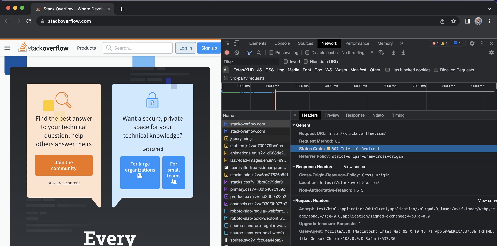
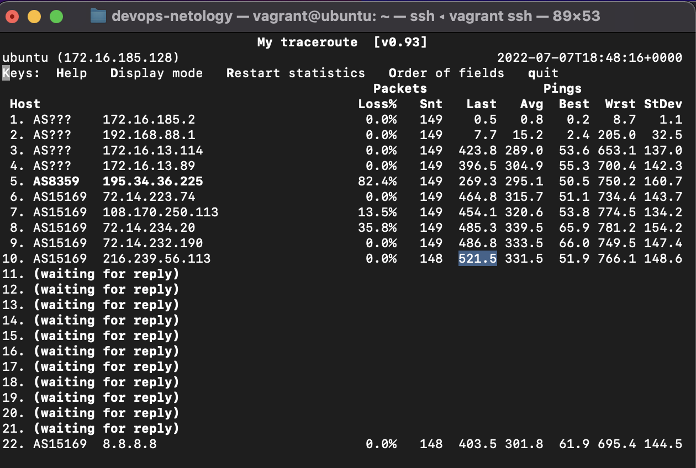

1 \
HTTP/1.1 301 Moved Permanently \
Код состояния HTTP 301 или Moved Permanently (с англ. — «Перемещено навсегда») — стандартный код ответа HTTP, получаемый в ответ от сервера в ситуации, когда запрошенный ресурс был на постоянной основе перемещён в новое месторасположение, и указывающий на то, что текущие ссылки, использующие данный URL, должны быть обновлены. Адрес нового месторасположения ресурса указывается в поле Location получаемого в ответ заголовка пакета протокола HTTP 

другими словами произошел редирект на новый url, в котором http протокол замене на https

```bash
vagrant@ubuntu:~$ telnet stackoverflow.com 80
Trying 151.101.65.69...
Connected to stackoverflow.com.
Escape character is '^]'.
GET /questions HTTP/1.0
HOST: stackoverflow.com


HTTP/1.1 301 Moved Permanently
cache-control: no-cache, no-store, must-revalidate
location: https://stackoverflow.com/questions
x-request-guid: 0b92821c-23fb-4a01-bd7a-a79ba7915ce4
feature-policy: microphone 'none'; speaker 'none'
content-security-policy: upgrade-insecure-requests; frame-ancestors 'self' https://stackexchange.com
Accept-Ranges: bytes
Date: Thu, 07 Jul 2022 17:56:49 GMT
Via: 1.1 varnish
Connection: close
X-Served-By: cache-fra19128-FRA
X-Cache: MISS
X-Cache-Hits: 0
X-Timer: S1657216610.648156,VS0,VE94
Vary: Fastly-SSL
X-DNS-Prefetch-Control: off
Set-Cookie: prov=a4d64043-0282-2856-5cd6-634f009e2ec4; domain=.stackoverflow.com; expires=Fri, 01-Jan-2055 00:00:00 GMT; path=/; HttpOnly

Connection closed by foreign host.
```

2 \
Status code 307 Internal redirect

дольше всех работал запрос, вызывающий analytics.js \


3 \
213.87.154.249
```bash
vagrant@ubuntu:~$ dig TXT +short o-o.myaddr.l.google.com @ns1.google.com
"213.87.154.249"
vagrant@ubuntu:~$ curl ifconfig.co
213.87.154.249
vagrant@ubuntu:~$ 
```

4 \
провайдер MTS, AS8359 \
`sudo apt install whois` -  ставим утилиту
```bash
vagrant@ubuntu:~$ curl ifconfig.co | xargs whois
  % Total    % Received % Xferd  Average Speed   Time    Time     Time  Current
                                 Dload  Upload   Total   Spent    Left  Speed
100    15  100    15    0     0     48      0 --:--:-- --:--:-- --:--:--    48
% This is the RIPE Database query service.
% The objects are in RPSL format.
%
% The RIPE Database is subject to Terms and Conditions.
% See http://www.ripe.net/db/support/db-terms-conditions.pdf

% Note: this output has been filtered.
%       To receive output for a database update, use the "-B" flag.

% Information related to '213.87.128.0 - 213.87.159.255'

% Abuse contact for '213.87.128.0 - 213.87.159.255' is 'abuse@mtu.ru'

inetnum:        213.87.128.0 - 213.87.159.255
netname:        MTSGPRS-3
descr:          Mobile subscribers pool
remarks:        INFRA-AW
country:        RU
admin-c:        MTU1-RIPE
tech-c:         MTU1-RIPE
admin-c:        MTSA
tech-c:         MTSN
status:         ASSIGNED PA
mnt-by:         MTSNET-MNT
mnt-by:         MTU-NOC
mnt-routes:     MTSNET-MNT
mnt-routes:     MTU-NOC
created:        2015-08-25T13:07:29Z
last-modified:  2015-08-25T13:07:29Z
source:         RIPE

role:           MTSNET Administration
address:        MTS PJSC
address:        4, Marksistskaya str., 109147 Moscow, Russia
remarks:        **************************************
remarks:        Contact addresses:
remarks:        routing & peering noc@mtu.ru
remarks:        spam & security abuse@mtu.ru
remarks:        mail postmaster@mtu.ru
remarks:        ddos reports ddos-reports@mtu.ru
remarks:        **************************************
mnt-by:         MTSNET-MNT
admin-c:        YUF-RIPE
tech-c:         YUF-RIPE
nic-hdl:        MTSA
created:        2004-04-03T10:05:17Z
last-modified:  2019-05-29T08:19:05Z
source:         RIPE # Filtered

role:           MTSNET NOC
address:        MTS PJSC
address:        4, Marksistskaya str.
address:        109147 Moscow, Russia
remarks:        abuse-mailbox: info@mts.ru
admin-c:        YUF-RIPE
tech-c:         YUF-RIPE
nic-hdl:        MTSN
created:        2004-04-03T09:50:46Z
last-modified:  2018-08-22T11:56:16Z
source:         RIPE # Filtered
mnt-by:         MTSNET-MNT

role:           MTS backbone NOC
address:        PJSC MTS / former CJSC Comstar-Direct
address:        Petrovsky blvd 12, bldg 3
address:        P.O. BOX 4711 127051
address:        Moscow, Russia
remarks:        **************************************
remarks:        Contact addresses:
remarks:        routing & peering noc@mtu.ru
remarks:        spam & security abuse@mtu.ru
remarks:        mail postmaster@mtu.ru
remarks:        ddos reports ddos-reports@mtu.ru
remarks:        **************************************
phone:          +7 495 721-34-99
fax-no:         +7 495 956-07-07
admin-c:        EDA-RIPE
admin-c:        RPS-RIPE
tech-c:         EDA-RIPE
nic-hdl:        MTU1-RIPE
mnt-by:         MTU-NOC
created:        2002-10-18T13:29:19Z
last-modified:  2022-04-08T13:50:05Z
source:         RIPE # Filtered

% Information related to '213.87.144.0/20AS8359'

route:          213.87.144.0/20
descr:          Mobile TeleSystems, PJSC, NAT for GPRS/3G
origin:         AS8359
mnt-by:         MTSNET-MNT
mnt-by:         MTU-NOC
created:        2015-08-25T13:08:40Z
last-modified:  2015-08-25T13:08:40Z
source:         RIPE

% This query was served by the RIPE Database Query Service version 1.103 (BLAARKOP)
```
5 
```bash
vagrant@ubuntu:~$ traceroute -An 8.8.8.8
traceroute to 8.8.8.8 (8.8.8.8), 30 hops max, 60 byte packets
 1  172.16.185.2 [*]  0.546 ms  0.888 ms  0.754 ms
 2  192.168.88.1 [*]  52.960 ms  55.511 ms  63.262 ms
 3  172.16.13.114 [*]  98.119 ms  98.073 ms  112.401 ms
 4  172.16.13.93 [*]  120.526 ms  149.089 ms  155.261 ms
 5  195.34.36.225 [AS8359]  155.249 ms * *
 6  72.14.223.74 [AS15169]  196.527 ms  159.609 ms 72.14.223.72 [AS15169]  415.255 ms
 7  108.170.250.51 [AS15169]  441.472 ms  441.434 ms *
 8  142.250.238.138 [AS15169]  719.137 ms  744.289 ms 142.250.238.214 [AS15169]  744.253 ms
 9  142.250.235.62 [AS15169]  814.592 ms 142.250.235.68 [AS15169]  827.322 ms 74.125.253.109 [AS15169]  827.269 ms
10  142.250.56.13 [AS15169]  831.261 ms 216.239.42.23 [AS15169]  831.207 ms 216.239.40.61 [AS15169]  832.726 ms
11  * * *
12  * * *
13  * * *
14  * * *
15  * * *
16  * * *
17  * * *
18  * * *
19  * * *
20  8.8.8.8 [AS15169]  1063.659 ms  1077.824 ms  1092.254 ms
```
6 \
Худшие delay: \
Last - в последнем пакете хоп 10 \
Avg - по среднему значению хоп 8 \
Wrst - по наихудшему за время работы хоп 8 \


7 \

vagrant@ubuntu:~$ dig ns dns.google 

NS	ns1.zdns.google. \
NS  ns2.zdns.google. \
NS	ns3.zdns.google. \
NS	ns4.zdns.google. 

``` bash 
; <<>> DiG 9.16.1-Ubuntu <<>> ns dns.google
;; global options: +cmd
;; Got answer:
;; ->>HEADER<<- opcode: QUERY, status: NOERROR, id: 50712
;; flags: qr rd ra; QUERY: 1, ANSWER: 4, AUTHORITY: 0, ADDITIONAL: 1

;; OPT PSEUDOSECTION:
; EDNS: version: 0, flags:; udp: 65494
;; QUESTION SECTION:
;dns.google.			IN	NS

;; ANSWER SECTION:
dns.google.		5	IN	NS	ns1.zdns.google.
dns.google.		5	IN	NS	ns2.zdns.google.
dns.google.		5	IN	NS	ns3.zdns.google.
dns.google.		5	IN	NS	ns4.zdns.google.

;; Query time: 360 msec
;; SERVER: 127.0.0.53#53(127.0.0.53)
;; WHEN: Wed Jul 06 20:33:28 UTC 2022
;; MSG SIZE  rcvd: 116
```
vagrant@ubuntu:~$ dig dns.google \
A	8.8.4.4 \
A	8.8.8.8
```bash
; <<>> DiG 9.16.1-Ubuntu <<>> dns.google
;; global options: +cmd
;; Got answer:
;; ->>HEADER<<- opcode: QUERY, status: NOERROR, id: 54536
;; flags: qr rd ra; QUERY: 1, ANSWER: 2, AUTHORITY: 0, ADDITIONAL: 1

;; OPT PSEUDOSECTION:
; EDNS: version: 0, flags:; udp: 65494
;; QUESTION SECTION:
;dns.google.			IN	A

;; ANSWER SECTION:
dns.google.		5	IN	A	8.8.4.4
dns.google.		5	IN	A	8.8.8.8

;; Query time: 179 msec
;; SERVER: 127.0.0.53#53(127.0.0.53)
;; WHEN: Wed Jul 06 20:35:07 UTC 2022
;; MSG SIZE  rcvd: 71
```


