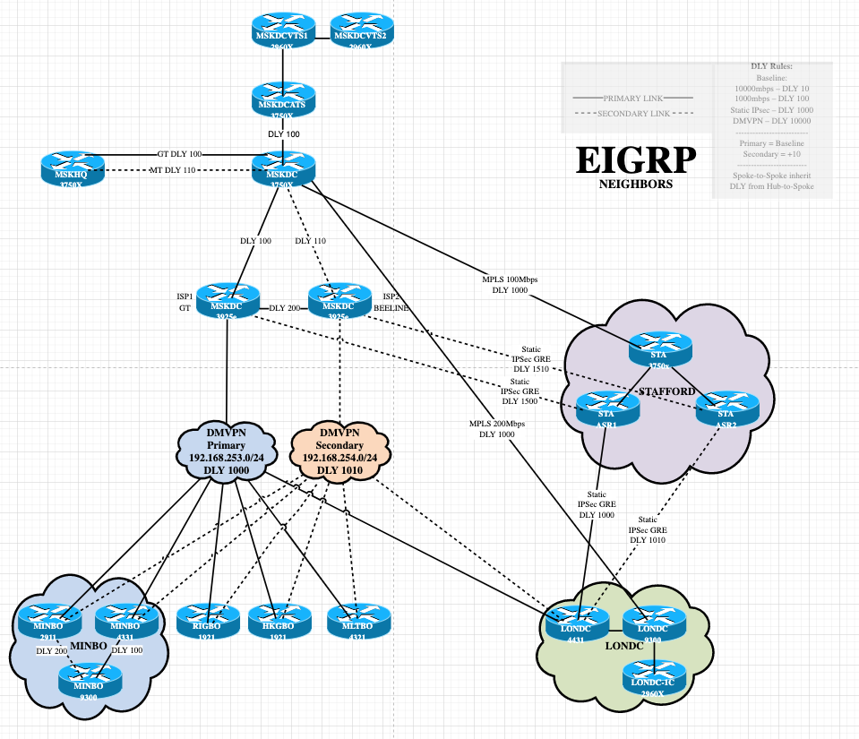

1 \
```bash
route-views>sh ip route 213.87.158.22    
Routing entry for 213.87.128.0/19, supernet
  Known via "bgp 6447", distance 20, metric 0
  Tag 2497, type external
  Last update from 202.232.0.2 7w0d ago
  Routing Descriptor Blocks:
  * 202.232.0.2, from 202.232.0.2, 7w0d ago
      Route metric is 0, traffic share count is 1
      AS Hops 2
      Route tag 2497
      MPLS label: none
route-views>sh bgp 213.87.158.22           
BGP routing table entry for 213.87.128.0/19, version 2288609765
Paths: (23 available, best #22, table default)
  Not advertised to any peer
  Refresh Epoch 1
  8283 8359
    94.142.247.3 from 94.142.247.3 (94.142.247.3)
      Origin IGP, metric 0, localpref 100, valid, external
      Community: 8283:1 8283:101 8283:102 8359:5500 8359:16012 8359:55277
      unknown transitive attribute: flag 0xE0 type 0x20 length 0x24
        value 0000 205B 0000 0000 0000 0001 0000 205B
              0000 0005 0000 0001 0000 205B 0000 0005
              0000 0002 
      path 7FE01FA15320 RPKI State valid
      rx pathid: 0, tx pathid: 0
      Refresh Epoch 1
  701 3356 8359
    137.39.3.55 from 137.39.3.55 (137.39.3.55)
      Origin IGP, localpref 100, valid, external
      path 7FE0A181D8F0 RPKI State valid
      rx pathid: 0, tx pathid: 0
  Refresh Epoch 1
  3356 8359
    4.68.4.46 from 4.68.4.46 (4.69.184.201)
      Origin IGP, metric 0, localpref 100, valid, external
      Community: 3356:2 3356:22 3356:100 3356:123 3356:507 3356:901 3356:2111 8359:5500 8359:16012 8359:55277
      path 7FE16D3697C8 RPKI State valid
      rx pathid: 0, tx pathid: 0
  Refresh Epoch 1
  57866 3356 8359
    37.139.139.17 from 37.139.139.17 (37.139.139.17)
      Origin IGP, metric 0, localpref 100, valid, external
      Community: 3356:2 3356:22 3356:100 3356:123 3356:507 3356:901 3356:2111 8359:5500 8359:16012 8359:55277
      path 7FE14FDA8460 RPKI State valid
      rx pathid: 0, tx pathid: 0
  Refresh Epoch 1
  3267 3356 8359
    194.85.40.15 from 194.85.40.15 (185.141.126.1)
      Origin IGP, metric 0, localpref 100, valid, external
      path 7FE0D66C19C8 RPKI State valid
      rx pathid: 0, tx pathid: 0
  Refresh Epoch 1
  53767 174 174 3356 8359
    162.251.163.2 from 162.251.163.2 (162.251.162.3)
      Origin IGP, localpref 100, valid, external
      Community: 174:21000 174:22013 53767:5000
      path 7FE0A99A0FE8 RPKI State valid
      rx pathid: 0, tx pathid: 0
  Refresh Epoch 1
  6939 8359
    64.71.137.241 from 64.71.137.241 (216.218.252.164)
      Origin IGP, localpref 100, valid, external
      path 7FE0B9DC1BF8 RPKI State valid
      rx pathid: 0, tx pathid: 0
  Refresh Epoch 1
  20912 3257 3356 8359
    212.66.96.126 from 212.66.96.126 (212.66.96.126)
      Origin IGP, localpref 100, valid, external
      Community: 3257:8070 3257:30515 3257:50001 3257:53900 3257:53902 20912:65004
      path 7FE1125C1B20 RPKI State valid
      rx pathid: 0, tx pathid: 0
  Refresh Epoch 1
  19214 3257 3356 8359
  208.74.64.40 from 208.74.64.40 (208.74.64.40)
      Origin IGP, localpref 100, valid, external
      Community: 3257:8108 3257:30048 3257:50002 3257:51200 3257:51203
      path 7FE0E3973AC8 RPKI State valid
      rx pathid: 0, tx pathid: 0
  Refresh Epoch 1
  1351 8359 8359
    132.198.255.253 from 132.198.255.253 (132.198.255.253)
      Origin IGP, localpref 100, valid, external
      path 7FE1160DB0A8 RPKI State valid
      rx pathid: 0, tx pathid: 0
  Refresh Epoch 1
  20130 6939 8359
    140.192.8.16 from 140.192.8.16 (140.192.8.16)
      Origin IGP, localpref 100, valid, external
      path 7FE11CDBCB28 RPKI State valid
      rx pathid: 0, tx pathid: 0
  Refresh Epoch 1
  3333 8359
    193.0.0.56 from 193.0.0.56 (193.0.0.56)
      Origin IGP, localpref 100, valid, external
      Community: 8359:5500 8359:16012 8359:55277
      path 7FE1434BF078 RPKI State valid
      rx pathid: 0, tx pathid: 0
  Refresh Epoch 1
  4901 6079 8359
    162.250.137.254 from 162.250.137.254 (162.250.137.254)
      Origin IGP, localpref 100, valid, external
      Community: 65000:10100 65000:10300 65000:10400
      path 7FE106996FD0 RPKI State valid
      rx pathid: 0, tx pathid: 0
  Refresh Epoch 1
  7018 3356 8359
    12.0.1.63 from 12.0.1.63 (12.0.1.63)
      Origin IGP, localpref 100, valid, external
      Community: 7018:5000 7018:37232
      path 7FE1360BF870 RPKI State valid
      rx pathid: 0, tx pathid: 0
  Refresh Epoch 1
  101 3356 8359
    209.124.176.223 from 209.124.176.223 (209.124.176.223)
      Origin IGP, localpref 100, valid, external
      Community: 101:20100 101:20110 101:22100 3356:2 3356:22 3356:100 3356:123 3356:507 3356:901 3356:2111 8359:5500 8359:16012 8359:55277
      Extended Community: RT:101:22100
      path 7FE0FD4CC268 RPKI State valid
      rx pathid: 0, tx pathid: 0
  Refresh Epoch 1
  49788 12552 8359
    91.218.184.60 from 91.218.184.60 (91.218.184.60)
      Origin IGP, localpref 100, valid, external
      Community: 12552:12000 12552:12100 12552:12101 12552:22000
      Extended Community: 0x43:100:1
      path 7FE0BDEB05E8 RPKI State valid
      rx pathid: 0, tx pathid: 0
  Refresh Epoch 1
  852 3356 8359
    154.11.12.212 from 154.11.12.212 (96.1.209.43)
      Origin IGP, metric 0, localpref 100, valid, external
      path 7FE0F66E58A8 RPKI State valid
      rx pathid: 0, tx pathid: 0
  Refresh Epoch 1
  3549 3356 8359
Refresh Epoch 1
  101 3356 8359
    209.124.176.223 from 209.124.176.223 (209.124.176.223)
      Origin IGP, localpref 100, valid, external
      Community: 101:20100 101:20110 101:22100 3356:2 3356:22 3356:100 3356:123 3356:507 3356:901 3356:2111 8359:5500 8359:16012 8359:55277
      Extended Community: RT:101:22100
      path 7FE0FD4CC268 RPKI State valid
      rx pathid: 0, tx pathid: 0
  Refresh Epoch 1
  49788 12552 8359
    91.218.184.60 from 91.218.184.60 (91.218.184.60)
      Origin IGP, localpref 100, valid, external
      Community: 12552:12000 12552:12100 12552:12101 12552:22000
      Extended Community: 0x43:100:1
      path 7FE0BDEB05E8 RPKI State valid
      rx pathid: 0, tx pathid: 0
  Refresh Epoch 1
  852 3356 8359
    154.11.12.212 from 154.11.12.212 (96.1.209.43)
      Origin IGP, metric 0, localpref 100, valid, external
      path 7FE0F66E58A8 RPKI State valid
      rx pathid: 0, tx pathid: 0
  Refresh Epoch 1
  3549 3356 8359
    208.51.134.254 from 208.51.134.254 (67.16.168.191)
      Origin IGP, metric 0, localpref 100, valid, external
      Community: 3356:2 3356:22 3356:100 3356:123 3356:507 3356:901 3356:2111 3549:2581 3549:30840 8359:5500 8359:16012 8359:55277
      path 7FE03A7AD478 RPKI State valid
      rx pathid: 0, tx pathid: 0
  Refresh Epoch 1
  7660 2516 1299 8359
    203.181.248.168 from 203.181.248.168 (203.181.248.168)
      Origin IGP, localpref 100, valid, external
      Community: 2516:1030 7660:9001
      path 7FE0B2BAE608 RPKI State valid
      rx pathid: 0, tx pathid: 0
  Refresh Epoch 1
  3561 3910 3356 8359
    206.24.210.80 from 206.24.210.80 (206.24.210.80)
      Origin IGP, localpref 100, valid, external
      path 7FE16B504708 RPKI State valid
      rx pathid: 0, tx pathid: 0
  Refresh Epoch 1
  3303 8359
    217.192.89.50 from 217.192.89.50 (138.187.128.158)
      Origin IGP, localpref 100, valid, external
      Community: 3303:1004 3303:1006 3303:1030 3303:3054 8359:5500 8359:16012 8359:55277
      path 7FE096134318 RPKI State valid
      rx pathid: 0, tx pathid: 0
  Refresh Epoch 3
  2497 8359
    202.232.0.2 from 202.232.0.2 (58.138.96.254)
      Origin IGP, localpref 100, valid, external, best
      path 7FE104C72EA0 RPKI State valid
      rx pathid: 0, tx pathid: 0x0
  Refresh Epoch 1
  3257 3356 8359
    89.149.178.10 from 89.149.178.10 (213.200.83.26)
      Origin IGP, metric 10, localpref 100, valid, external
      Community: 3257:8794 3257:30043 3257:50001 3257:54900 3257:54901
      path 7FE032F50A68 RPKI State valid
      rx pathid: 0, tx pathid: 0
```
2
```bash
sudo vim /etc/systemd/network/dummy0.network
vagrant@ubuntu:~$ cat /etc/systemd/network/dummy0.network
[Match]
Name=dummy0
[Network]
Address=192.168.50.3
Mask=255.255.255.0

vagrant@ubuntu:~$ sudo vim /etc/systemd/network/dummy0.netdev
[NetDev]
Name=dummy0
Kind=dummy
```
после перезапуска
```bash
vagrant@vagrant:~$ ip a
1: lo: <LOOPBACK,UP,LOWER_UP> mtu 65536 qdisc noqueue state UNKNOWN group default qlen 1000
    link/loopback 00:00:00:00:00:00 brd 00:00:00:00:00:00
    inet 127.0.0.1/8 scope host lo
       valid_lft forever preferred_lft forever
    inet6 ::1/128 scope host 
       valid_lft forever preferred_lft forever
2: eth0: <BROADCAST,MULTICAST,UP,LOWER_UP> mtu 1500 qdisc fq_codel state UP group default qlen 1000
    link/ether 08:00:27:a2:6b:fd brd ff:ff:ff:ff:ff:ff
    inet 10.0.2.15/24 brd 10.0.2.255 scope global dynamic eth0
       valid_lft 86340sec preferred_lft 86340sec
    inet6 fe80::a00:27ff:fea2:6bfd/64 scope link 
       valid_lft forever preferred_lft forever
3: dummy0: <BROADCAST,NOARP,UP,LOWER_UP> mtu 1500 qdisc noqueue state UNKNOWN group default qlen 1000
    link/ether 7e:f5:36:7a:89:07 brd ff:ff:ff:ff:ff:ff
    inet 192.168.50.3/24 brd 192.168.50.255 scope global dummy0
       valid_lft forever preferred_lft forever
    inet6 fe80::7cf5:36ff:fe7a:8907/64 scope link 
       valid_lft forever preferred_lft forever
vagrant@vagrant:~$ sudo -i
root@vagrant:~# ip r
default via 10.0.2.2 dev eth0 proto dhcp src 10.0.2.15 metric 100 
10.0.2.0/24 dev eth0 proto kernel scope link src 10.0.2.15 
10.0.2.2 dev eth0 proto dhcp scope link src 10.0.2.15 metric 100 
192.168.50.0/24 dev dummy0 proto kernel scope link src 192.168.50.3 
root@vagrant:~# ip route add 172.10.1.0/24 via 10.0.2.2
root@vagrant:~# ip route add 10.1.1.1/32 via 10.0.2.2
root@vagrant:~# ip r
default via 10.0.2.2 dev eth0 proto dhcp src 10.0.2.15 metric 100 
10.0.2.0/24 dev eth0 proto kernel scope link src 10.0.2.15 
10.0.2.2 dev eth0 proto dhcp scope link src 10.0.2.15 metric 100 
10.1.1.1 via 10.0.2.2 dev eth0 
172.10.1.0/24 via 10.0.2.2 dev eth0 
192.168.50.0/24 dev dummy0 proto kernel scope link src 192.168.50.3 
```
3
```bash
root@vagrant:~# ss -lp
tcp             LISTEN           0                 128                                                             0.0.0.0:ssh                                            0.0.0.0:*                users:(("sshd",pid=703,fd=3))                                              
tcp             LISTEN           0                 4096                                                                  *:9100                                                 *:*                users:(("node_exporter",pid=646,fd=3))                                     
tcp             LISTEN           0                 128                                                                [::]:ssh                                               [::]:*                users:(("sshd",pid=703,fd=4))
```
22 порт - прослушивает SSH сервер, для удаленного подключения к виртуалке \
9100 - прослушивает node_exporter, утилита сбора метрик производительности, установлена в одной из прошлых домашних работ \

4
```bash
root@vagrant:~# ss -uap
State                       Recv-Q                      Send-Q                                            Local Address:Port                                             Peer Address:Port                     Process                                                        
UNCONN                      0                           0                                                     127.0.0.1:8125                                                  0.0.0.0:*                         users:(("netdata",pid=642,fd=43))                             
UNCONN                      0                           0                                                 127.0.0.53%lo:domain                                                0.0.0.0:*                         users:(("systemd-resolve",pid=620,fd=12))                     
UNCONN                      0                           0                                                10.0.2.15%eth0:bootpc                                                0.0.0.0:*                         users:(("systemd-network",pid=615,fd=21)) 
```
127.0.0.1:8125 - пакет NetData, был установлен в одной из прошлых домашних работ \
127.0.0.53%lo:domain - DOMAIN (Domain Name System, DNS) \
10.0.2.15%eth0:bootpc - BOOTPC (Bootstrap Protocol Client) — для клиентов бездисковых рабочих станций, загружающихся с сервера BOOTP; также используется DHCP (Dynamic Host Configuration Protocol) \

5 \
Схема сети на работе \
В центре Cisco DMVPN Dual-Hub. Установлен в центральном ЦОД. Все региональные офисы подключены к нему 2 ipsec туннелями для надежности. Переключение траффика осуществляется динамически протоколом EIGRP. Крупные площадки соединены дополнительно выделлеными MPLS каналами. \
