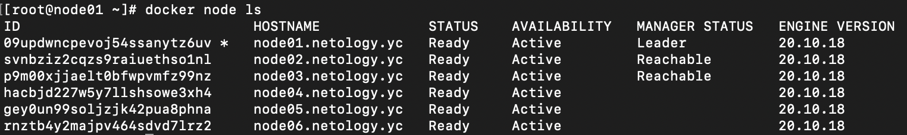
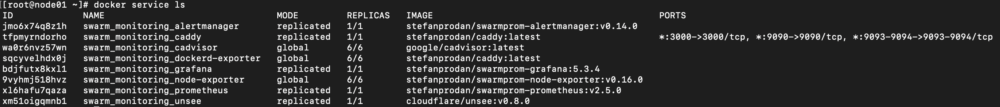

1 \

1.1 Основное отличие режимов replication и global заключается в том, что в режиме global не нужно указаывать кол-во 
запущенных экземпляров приложения, по умолчанию таски запускаются на каждой worker ноде (подходит для запуска 
контейнеров которые должны работать на кажом узле - мониторинг, антивирус, сборщик логов и т.д); в режиме replication 
нужно в явном виде задавать кол-во запущенных экземпляров

1.2 Для выбора лидера используется алгоритм RAFT (RAFT consensus group); Консенсус предполагает, что несколько серверов согласовывуют значения. Как только они принимают решение о значении, это решение является окончательным. Типичные алгоритмы консенсуса добиваются прогресса, когда доступно любое большинство их серверов; например, кластер из 5 серверов может продолжать работать, даже если 2 сервера выходят из строя.
1.3  Overlay network - тип сети в docker, позволяющий объединить контейнеры в сеть на разных хостах без необходимости проводить какие-либо настройки на уровне операционной системы

2

3

