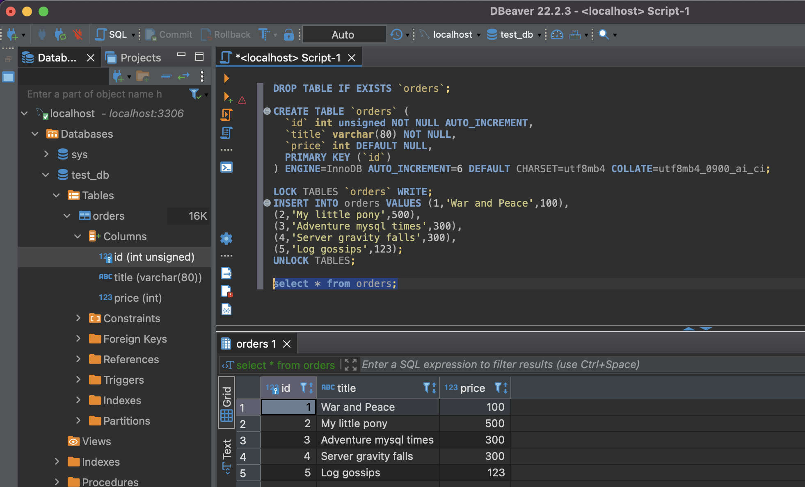

1 
```yamlex
  mysql:
    image: mysql:8
    command: --default-authentication-plugin=mysql_native_password
    environment:
      MYSQL_ROOT_PASSWORD: example
    volumes:
      - /opt/mysql/vol_data:/var/lib/mysql
    ports:
      - "3306:3306"
    restart: unless-stopped
```
Порт проброшен в виртуалку, в виртуалке проброшен в контейнер. Бэкап (убрал коменты закомментированные) развернут с помощью dbever.

```bash
bash-4.4# mysql --user=root --password=example test_db
mysql: [Warning] Using a password on the command line interface can be insecure.
Reading table information for completion of table and column names
You can turn off this feature to get a quicker startup with -A

Welcome to the MySQL monitor.  Commands end with ; or \g.
Your MySQL connection id is 14
Server version: 8.0.31 MySQL Community Server - GPL

Copyright (c) 2000, 2022, Oracle and/or its affiliates.

Oracle is a registered trademark of Oracle Corporation and/or its
affiliates. Other names may be trademarks of their respective
owners.

Type 'help;' or '\h' for help. Type '\c' to clear the current input statement.
mysql> 
```
```bash
mysql> \h

For information about MySQL products and services, visit:
   http://www.mysql.com/
For developer information, including the MySQL Reference Manual, visit:
   http://dev.mysql.com/
To buy MySQL Enterprise support, training, or other products, visit:
   https://shop.mysql.com/

List of all MySQL commands:
Note that all text commands must be first on line and end with ';'
?         (\?) Synonym for `help'.
clear     (\c) Clear the current input statement.
connect   (\r) Reconnect to the server. Optional arguments are db and host.
delimiter (\d) Set statement delimiter.
edit      (\e) Edit command with $EDITOR.
ego       (\G) Send command to mysql server, display result vertically.
exit      (\q) Exit mysql. Same as quit.
go        (\g) Send command to mysql server.
help      (\h) Display this help.
nopager   (\n) Disable pager, print to stdout.
notee     (\t) Don't write into outfile.
pager     (\P) Set PAGER [to_pager]. Print the query results via PAGER.
print     (\p) Print current command.
prompt    (\R) Change your mysql prompt.
quit      (\q) Quit mysql.
rehash    (\#) Rebuild completion hash.
source    (\.) Execute an SQL script file. Takes a file name as an argument.
status    (\s) Get status information from the server.
system    (\!) Execute a system shell command.
tee       (\T) Set outfile [to_outfile]. Append everything into given outfile.
use       (\u) Use another database. Takes database name as argument.
charset   (\C) Switch to another charset. Might be needed for processing binlog with multi-byte charsets.
warnings  (\W) Show warnings after every statement.
nowarning (\w) Don't show warnings after every statement.
resetconnection(\x) Clean session context.
query_attributes Sets string parameters (name1 value1 name2 value2 ...) for the next query to pick up.
ssl_session_data_print Serializes the current SSL session data to stdout or file

For server side help, type 'help contents'

mysql>
```
```bash
mysql> status
--------------
mysql  Ver 8.0.31 for Linux on aarch64 (MySQL Community Server - GPL)

Connection id:		14
Current database:	test_db
Current user:		root@localhost
SSL:			Not in use
Current pager:		stdout
Using outfile:		''
Using delimiter:	;
Server version:		8.0.31 MySQL Community Server - GPL
Protocol version:	10
Connection:		Localhost via UNIX socket
Server characterset:	utf8mb4
Db     characterset:	utf8mb4
Client characterset:	latin1
Conn.  characterset:	latin1
UNIX socket:		/var/run/mysqld/mysqld.sock
Binary data as:		Hexadecimal
Uptime:			1 day 54 min 10 sec

Threads: 5  Questions: 94  Slow queries: 0  Opens: 193  Flush tables: 3  Open tables: 112  Queries per second avg: 0.001
--------------

mysql>
```
```bash
mysql> show tables;
+-------------------+
| Tables_in_test_db |
+-------------------+
| orders            |
+-------------------+
1 row in set (0.00 sec)

mysql>
```
```bash
mysql> select count(*) from orders where price >300;
+----------+
| count(*) |
+----------+
|        1 |
+----------+
1 row in set (0.01 sec)
```
2
```bash
mysql> CREATE USER 'test'@'localhost' IDENTIFIED BY 'test-pass';
Query OK, 0 rows affected (0.06 sec)

mysql> ALTER USER 'test'@'localhost'
    ->   IDENTIFIED WITH mysql_native_password BY 'test_pass'
    ->   PASSWORD EXPIRE INTERVAL 180 DAY
    ->   FAILED_LOGIN_ATTEMPTS 3;
Query OK, 0 rows affected (0.02 sec)

mysql> ALTER USER 'test'@'localhost' WITH MAX_QUERIES_PER_HOUR 100;
Query OK, 0 rows affected (0.01 sec)

mysql> ALTER USER 'test'@'localhost' ATTRIBUTE '{"fname":"James", "lname":"Pretty"}';
Query OK, 0 rows affected (0.01 sec)

mysql> GRANT Select ON orders TO 'test'@'localhost';
Query OK, 0 rows affected, 1 warning (0.01 sec)

mysql> SHOW grants for 'test'@'localhost';
+----------------------------------------------------------+
| Grants for test@localhost                                |
+----------------------------------------------------------+
| GRANT USAGE ON *.* TO `test`@`localhost`                 |
| GRANT SELECT ON `test_db`.`orders` TO `test`@`localhost` |
+----------------------------------------------------------+
2 rows in set (0.01 sec)

mysql> SELECT * FROM INFORMATION_SCHEMA.USER_ATTRIBUTES WHERE USER='test';
+------+-----------+---------------------------------------+
| USER | HOST      | ATTRIBUTE                             |
+------+-----------+---------------------------------------+
| test | localhost | {"fname": "James", "lname": "Pretty"} |
+------+-----------+---------------------------------------+
1 row in set (0.01 sec)
```
3
```bash
mysql> SET profiling = 1;
Query OK, 0 rows affected, 1 warning (0.01 sec)

mysql> SHOW PROFILES;
Empty set, 1 warning (0.01 sec)

mysql> SELECT TABLE_NAME,ENGINE FROM information_schema.TABLES WHERE table_name = 'orders' and  TABLE_SCHEMA = 'test_db';
+------------+--------+
| TABLE_NAME | ENGINE |
+------------+--------+
| orders     | InnoDB |
+------------+--------+
1 row in set (0.02 sec)

mysql> ALTER TABLE orders ENGINE = MyISAM;
Query OK, 5 rows affected (0.09 sec)
Records: 5  Duplicates: 0  Warnings: 0

mysql> ALTER TABLE orders ENGINE = InnoDB;
Query OK, 5 rows affected (0.08 sec)
Records: 5  Duplicates: 0  Warnings: 0

mysql> SHOW PROFILES;
+----------+------------+-------------------------------------------------------------------------------------------------------------------+
| Query_ID | Duration   | Query                                                                                                             |
+----------+------------+-------------------------------------------------------------------------------------------------------------------+
|        1 | 0.02586925 | SELECT TABLE_NAME,ENGINE FROM information_schema.TABLES WHERE table_name = 'orders' and  TABLE_SCHEMA = 'test_db' |
|        2 | 0.07902650 | ALTER TABLE orders ENGINE = MyISAM                                                                                |
|        3 | 0.08004275 | ALTER TABLE orders ENGINE = InnoDB                                                                                |
+----------+------------+-------------------------------------------------------------------------------------------------------------------+
3 rows in set, 1 warning (0.02 sec)

```
4 \
Кастомный конфиг смерджится с основным конфигом, благодаря инструкции `!includedir /etc/mysql/conf.d/` в основном конфиге. нужно просто положить с помощью ansible
```yamlex
  mysql:
    image: mysql:8
    command: --default-authentication-plugin=mysql_native_password
    configs:
      - source: mysql_config
        target: /etc/mysql/conf.d/config-file.cnf
    environment:
      MYSQL_ROOT_PASSWORD: example
    volumes:
      - /opt/mysql/vol_data:/var/lib/mysql
    # - /opt/my/custom/config-file.cnf:/etc/mysql/conf.d
    ports:
      - "3306:3306"
    restart: unless-stopped
```
`config-file.cnf`
```bash
#Set IO Speed
# 0 - speed
# 1 - safety
# 2 - universal
innodb_flush_log_at_trx_commit = 0

#Set compression
# Barracuda - format with compression enabled
innodb_file_format=Barracuda

#Set buffer
innodb_log_buffer_size	= 1M

#Set Cache size
#vm mem = 1024M
key_buffer_size = 307М

#Set log size
max_binlog_size	= 100M
```