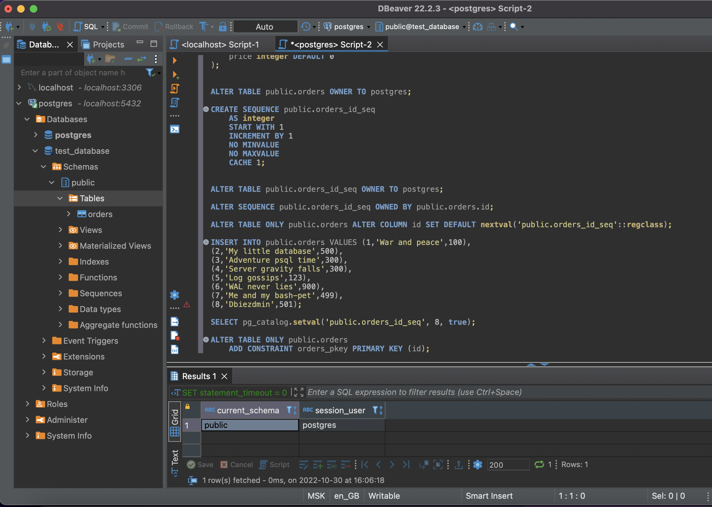

1 \
```yamlex
services:
  postgres:
    image: postgres:13
    environment:
      PGDATA: "/var/lib/postgresql/data/pgdata"
      POSTGRES_PASSWORD: example
    volumes:
      - /opt/pg/vol_data:/var/lib/postgresql/data
    ports:
      - "5432:5432"
    restart: unless-stopped
```
```bash
vagrant@server1:~$ docker exec -it stack-postgres-1 bash
root@7781504c46bb:/# psql -U postgres
psql (13.8 (Debian 13.8-1.pgdg110+1))
Type "help" for help.
```
```bash
postgres=# \l
                                 List of databases
   Name    |  Owner   | Encoding |  Collate   |   Ctype    |   Access privileges   
-----------+----------+----------+------------+------------+-----------------------
 postgres  | postgres | UTF8     | en_US.utf8 | en_US.utf8 | 
 template0 | postgres | UTF8     | en_US.utf8 | en_US.utf8 | =c/postgres          +
           |          |          |            |            | postgres=CTc/postgres
 template1 | postgres | UTF8     | en_US.utf8 | en_US.utf8 | =c/postgres          +
           |          |          |            |            | postgres=CTc/postgres
(3 rows)

postgres=# \c postgres
You are now connected to database "postgres" as user "postgres".

postgres=# \dtS
                    List of relations
   Schema   |          Name           | Type  |  Owner   
------------+-------------------------+-------+----------
 pg_catalog | pg_aggregate            | table | postgres
 pg_catalog | pg_am                   | table | postgres
 pg_catalog | pg_amop                 | table | postgres
 pg_catalog | pg_amproc               | table | postgres
 pg_catalog | pg_attrdef              | table | postgres
 <...>
```
пример для `pg_am`
```bash
postgres=# \dS+ pg_am
                                  Table "pg_catalog.pg_am"
  Column   |  Type   | Collation | Nullable | Default | Storage | Stats target | Description 
-----------+---------+-----------+----------+---------+---------+--------------+-------------
 oid       | oid     |           | not null |         | plain   |              | 
 amname    | name    |           | not null |         | plain   |              | 
 amhandler | regproc |           | not null |         | plain   |              | 
 amtype    | "char"  |           | not null |         | plain   |              | 
Indexes:
    "pg_am_name_index" UNIQUE, btree (amname)
    "pg_am_oid_index" UNIQUE, btree (oid)
Access method: heap

postgres=# \q
root@7781504c46bb:/# 
```
2
```bash
postgres=# create database test_database;
CREATE DATABASE
postgres=# 
```
бэкап восстановлен черз dbeaver, порт проброшен в виртуалку, далее в контейнер

секция не отработала
```text
COPY public.orders (id, title, price) FROM stdin;
1	War and peace	100
2	My little database	500
3	Adventure psql time	300
4	Server gravity falls	300
5	Log gossips	123
6	WAL never lies	900
7	Me and my bash-pet	499
8	Dbiezdmin	501
\.
```
переделал
```text
INSERT INTO public.orders VALUES (1,'War and peace',100),
(2,'My little database',500),
(3,'Adventure psql time',300),
(4,'Server gravity falls',300),
(5,'Log gossips',123),
(6,'WAL never lies',900),
(7,'Me and my bash-pet',499),
(8,'Dbiezdmin',501);
```

```bash
root@7781504c46bb:/# psql -U postgres
psql (13.8 (Debian 13.8-1.pgdg110+1))
Type "help" for help.

postgres=# \c test_database;
You are now connected to database "test_database" as user "postgres".
test_database=# ANALYZE VERBOSE public.orders;
INFO:  analyzing "public.orders"
INFO:  "orders": scanned 1 of 1 pages, containing 8 live rows and 1 dead rows; 8 rows in sample, 8 estimated total rows
ANALYZE
test_database=# select avg_width from pg_stats where tablename='orders';
 avg_width 
-----------
         4
        16
         4
(3 rows)

test_database=#
```
3 \
пересоздаем таблицу, делаем 2 партиции, наполняем данными, исходную удаляем 
```text
alter table public.orders rename to orders_temp;
CREATE TABLE public.orders (
    id integer NOT NULL,
    title character varying(80) NOT NULL,
    price integer DEFAULT 0
) partition by range (price);
create table public.orders_2 partition of public.orders for values from (0) to (499);
create table public.orders_1 partition of public.orders for values from (499) to (999);
insert into public.orders (id, title, price) select * from public.orders_temp;
drop table public.orders_temp;
```
конечно, можно было сразу сделать ее с партициями, тогда бы не пришлось переносить данные \

4
```bash
docker exec -t stack-postgres-1 pg_dump -U postgres test_database -f /var/lib/postgresql/data/backup1.sql
```
```text
cat /opt/pg/vol_data/backup1.sql 
--
-- PostgreSQL database dump
--

-- Dumped from database version 13.8 (Debian 13.8-1.pgdg110+1)
-- Dumped by pg_dump version 13.8 (Debian 13.8-1.pgdg110+1)

SET statement_timeout = 0;
SET lock_timeout = 0;
SET idle_in_transaction_session_timeout = 0;
SET client_encoding = 'UTF8';
SET standard_conforming_strings = on;
SELECT pg_catalog.set_config('search_path', '', false);
SET check_function_bodies = false;
SET xmloption = content;
SET client_min_messages = warning;
SET row_security = off;

SET default_tablespace = '';

--
-- Name: orders; Type: TABLE; Schema: public; Owner: postgres
--

CREATE TABLE public.orders (
    id integer NOT NULL,
    title character varying(80) NOT NULL,
    price integer DEFAULT 0
)
PARTITION BY RANGE (price);


ALTER TABLE public.orders OWNER TO postgres;

SET default_table_access_method = heap;

--
-- Name: orders_1; Type: TABLE; Schema: public; Owner: postgres
--

CREATE TABLE public.orders_1 (
    id integer NOT NULL,
    title character varying(80) NOT NULL,
    price integer DEFAULT 0
);
ALTER TABLE ONLY public.orders ATTACH PARTITION public.orders_1 FOR VALUES FROM (499) TO (999);


ALTER TABLE public.orders_1 OWNER TO postgres;

--
-- Name: orders_2; Type: TABLE; Schema: public; Owner: postgres
--

CREATE TABLE public.orders_2 (
    id integer NOT NULL,
    title character varying(80) NOT NULL,
    price integer DEFAULT 0
);
ALTER TABLE ONLY public.orders ATTACH PARTITION public.orders_2 FOR VALUES FROM (0) TO (499);


ALTER TABLE public.orders_2 OWNER TO postgres;

--
-- Data for Name: orders_1; Type: TABLE DATA; Schema: public; Owner: postgres
--

COPY public.orders_1 (id, title, price) FROM stdin;
2	My little database	500
6	WAL never lies	900
7	Me and my bash-pet	499
8	Dbiezdmin	501
\.


--
-- Data for Name: orders_2; Type: TABLE DATA; Schema: public; Owner: postgres
--

COPY public.orders_2 (id, title, price) FROM stdin;
1	War and peace	100
3	Adventure psql time	300
4	Server gravity falls	300
5	Log gossips	123
\.


--
-- PostgreSQL database dump complete
--

```