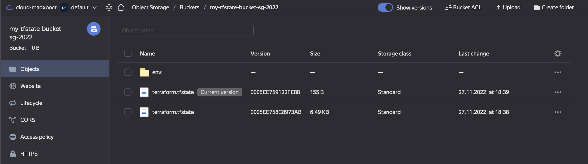

1\


2
```bash
➜  Terraform git:(main) terraform workspace list
  default
* prod
  stage
```

В ya.cloud отсутствует instance_type, поэтому пришлось немножко иначе сделать 

```terraform
resources {
    cores  = "${terraform.workspace == "prod" ? 4 : 2}"
    memory = "${terraform.workspace == "prod" ? 4 : 1}"
    core_fraction = "${terraform.workspace == "prod" ? 100 : 5}"
  }
```
Окружений может быть больше чем 2 (prod,stage), например prod, standby, etalon, stage, dev \
Поэтому более правильно было бы сделать список возможных типовых конфигураций, ну то есть эмулировать амазонвский список (t3.micro, t3.large, ...)  \
что сложновато пока, требует более детально изучения HCL


```bash
➜  Terraform git:(main) ✗ terraform plan
data.yandex_compute_image.ubuntu_image: Reading...
data.yandex_compute_image.ubuntu_image: Read complete after 1s [id=fd8smb7fj0o91i68s15v]

Terraform used the selected providers to generate the following execution plan. Resource actions are indicated with the following symbols:
  + create

Terraform will perform the following actions:

  # yandex_compute_instance.web[0] will be created
  + resource "yandex_compute_instance" "web" {
      + allow_stopping_for_update = true
      + created_at                = (known after apply)
      + folder_id                 = (known after apply)
      + fqdn                      = (known after apply)
      + hostname                  = (known after apply)
      + id                        = (known after apply)
      + metadata                  = {
          + "ssh-keys" = <<-EOT
                ubuntu:ssh-ed25519 AAAAC3NzaC1lZDI1NTE5AAAAIFzZoycvNzMeM7t1+WNWSXeb3Dfno+3O54lyy9tXCv8r madxboct@Sergejs-MacBook-Air.local
            EOT
        }
      + name                      = "web-prod"
      + network_acceleration_type = "standard"
      + platform_id               = "standard-v2"
      + service_account_id        = (known after apply)
      + status                    = (known after apply)
      + zone                      = (known after apply)

      + boot_disk {
          + auto_delete = true
          + device_name = (known after apply)
          + disk_id     = (known after apply)
          + mode        = (known after apply)

          + initialize_params {
              + block_size  = (known after apply)
              + description = (known after apply)
              + image_id    = "fd8smb7fj0o91i68s15v"
              + name        = (known after apply)
              + size        = 10
              + snapshot_id = (known after apply)
              + type        = "network-ssd"
            }
        }

      + network_interface {
          + index              = (known after apply)
          + ip_address         = (known after apply)
          + ipv4               = true
          + ipv6               = (known after apply)
          + ipv6_address       = (known after apply)
          + mac_address        = (known after apply)
          + nat                = true
          + nat_ip_address     = (known after apply)
          + nat_ip_version     = (known after apply)
          + security_group_ids = (known after apply)
          + subnet_id          = (known after apply)
        }

      + placement_policy {
          + host_affinity_rules = (known after apply)
          + placement_group_id  = (known after apply)
        }

      + resources {
          + core_fraction = 100
          + cores         = 4
          + memory        = 4
        }

      + scheduling_policy {
          + preemptible = false
        }
    }

  # yandex_compute_instance.web[1] will be created
  + resource "yandex_compute_instance" "web" {
      + allow_stopping_for_update = true
      + created_at                = (known after apply)
      + folder_id                 = (known after apply)
      + fqdn                      = (known after apply)
      + hostname                  = (known after apply)
      + id                        = (known after apply)
      + metadata                  = {
          + "ssh-keys" = <<-EOT
                ubuntu:ssh-ed25519 AAAAC3NzaC1lZDI1NTE5AAAAIFzZoycvNzMeM7t1+WNWSXeb3Dfno+3O54lyy9tXCv8r madxboct@Sergejs-MacBook-Air.local
            EOT
        }
      + name                      = "web-prod"
      + network_acceleration_type = "standard"
      + platform_id               = "standard-v2"
      + service_account_id        = (known after apply)
      + status                    = (known after apply)
      + zone                      = (known after apply)

      + boot_disk {
          + auto_delete = true
          + device_name = (known after apply)
          + disk_id     = (known after apply)
          + mode        = (known after apply)

          + initialize_params {
              + block_size  = (known after apply)
              + description = (known after apply)
              + image_id    = "fd8smb7fj0o91i68s15v"
              + name        = (known after apply)
              + size        = 10
              + snapshot_id = (known after apply)
              + type        = "network-ssd"
            }
        }

      + network_interface {
          + index              = (known after apply)
          + ip_address         = (known after apply)
          + ipv4               = true
          + ipv6               = (known after apply)
          + ipv6_address       = (known after apply)
          + mac_address        = (known after apply)
          + nat                = true
          + nat_ip_address     = (known after apply)
          + nat_ip_version     = (known after apply)
          + security_group_ids = (known after apply)
          + subnet_id          = (known after apply)
        }

      + placement_policy {
          + host_affinity_rules = (known after apply)
          + placement_group_id  = (known after apply)
        }

      + resources {
          + core_fraction = 100
          + cores         = 4
          + memory        = 4
        }

      + scheduling_policy {
          + preemptible = false
        }
    }

  # yandex_compute_instance.web2["w1"] will be created
  + resource "yandex_compute_instance" "web2" {
      + allow_stopping_for_update = true
      + created_at                = (known after apply)
      + folder_id                 = (known after apply)
      + fqdn                      = (known after apply)
      + hostname                  = (known after apply)
      + id                        = (known after apply)
      + metadata                  = {
          + "ssh-keys" = <<-EOT
                ubuntu:ssh-ed25519 AAAAC3NzaC1lZDI1NTE5AAAAIFzZoycvNzMeM7t1+WNWSXeb3Dfno+3O54lyy9tXCv8r madxboct@Sergejs-MacBook-Air.local
            EOT
        }
      + name                      = "web2-prod"
      + network_acceleration_type = "standard"
      + platform_id               = "standard-v2"
      + service_account_id        = (known after apply)
      + status                    = (known after apply)
      + zone                      = (known after apply)

      + boot_disk {
          + auto_delete = true
          + device_name = (known after apply)
          + disk_id     = (known after apply)
          + mode        = (known after apply)

          + initialize_params {
              + block_size  = (known after apply)
              + description = (known after apply)
              + image_id    = "fd8smb7fj0o91i68s15v"
              + name        = (known after apply)
              + size        = 10
              + snapshot_id = (known after apply)
              + type        = "network-ssd"
            }
        }

      + network_interface {
          + index              = (known after apply)
          + ip_address         = (known after apply)
          + ipv4               = true
          + ipv6               = (known after apply)
          + ipv6_address       = (known after apply)
          + mac_address        = (known after apply)
          + nat                = true
          + nat_ip_address     = (known after apply)
          + nat_ip_version     = (known after apply)
          + security_group_ids = (known after apply)
          + subnet_id          = (known after apply)
        }

      + placement_policy {
          + host_affinity_rules = (known after apply)
          + placement_group_id  = (known after apply)
        }

      + resources {
          + core_fraction = 100
          + cores         = 4
          + memory        = 4
        }

      + scheduling_policy {
          + preemptible = false
        }
    }

  # yandex_compute_instance.web2["w2"] will be created
  + resource "yandex_compute_instance" "web2" {
      + allow_stopping_for_update = true
      + created_at                = (known after apply)
      + folder_id                 = (known after apply)
      + fqdn                      = (known after apply)
      + hostname                  = (known after apply)
      + id                        = (known after apply)
      + metadata                  = {
          + "ssh-keys" = <<-EOT
                ubuntu:ssh-ed25519 AAAAC3NzaC1lZDI1NTE5AAAAIFzZoycvNzMeM7t1+WNWSXeb3Dfno+3O54lyy9tXCv8r madxboct@Sergejs-MacBook-Air.local
            EOT
        }
      + name                      = "web2-prod"
      + network_acceleration_type = "standard"
      + platform_id               = "standard-v2"
      + service_account_id        = (known after apply)
      + status                    = (known after apply)
      + zone                      = (known after apply)

      + boot_disk {
          + auto_delete = true
          + device_name = (known after apply)
          + disk_id     = (known after apply)
          + mode        = (known after apply)

          + initialize_params {
              + block_size  = (known after apply)
              + description = (known after apply)
              + image_id    = "fd8smb7fj0o91i68s15v"
              + name        = (known after apply)
              + size        = 10
              + snapshot_id = (known after apply)
              + type        = "network-ssd"
            }
        }

      + network_interface {
          + index              = (known after apply)
          + ip_address         = (known after apply)
          + ipv4               = true
          + ipv6               = (known after apply)
          + ipv6_address       = (known after apply)
          + mac_address        = (known after apply)
          + nat                = true
          + nat_ip_address     = (known after apply)
          + nat_ip_version     = (known after apply)
          + security_group_ids = (known after apply)
          + subnet_id          = (known after apply)
        }

      + placement_policy {
          + host_affinity_rules = (known after apply)
          + placement_group_id  = (known after apply)
        }

      + resources {
          + core_fraction = 100
          + cores         = 4
          + memory        = 4
        }

      + scheduling_policy {
          + preemptible = false
        }
    }

  # yandex_vpc_network.default will be created
  + resource "yandex_vpc_network" "default" {
      + created_at                = (known after apply)
      + default_security_group_id = (known after apply)
      + folder_id                 = (known after apply)
      + id                        = (known after apply)
      + labels                    = (known after apply)
      + name                      = "net"
      + subnet_ids                = (known after apply)
    }

  # yandex_vpc_subnet.default will be created
  + resource "yandex_vpc_subnet" "default" {
      + created_at     = (known after apply)
      + folder_id      = (known after apply)
      + id             = (known after apply)
      + labels         = (known after apply)
      + name           = "subnet"
      + network_id     = (known after apply)
      + v4_cidr_blocks = [
          + "192.168.101.0/24",
        ]
      + v6_cidr_blocks = (known after apply)
      + zone           = (known after apply)
    }

Plan: 6 to add, 0 to change, 0 to destroy.

Changes to Outputs:
  + subnet_id = (known after apply)
  + zone      = [
      + {
          + allow_recreate            = null
          + allow_stopping_for_update = true
          + boot_disk                 = [
              + {
                  + auto_delete       = true
                  + device_name       = (known after apply)
                  + disk_id           = (known after apply)
                  + initialize_params = [
                      + {
                          + block_size  = (known after apply)
                          + description = (known after apply)
                          + image_id    = "fd8smb7fj0o91i68s15v"
                          + name        = (known after apply)
                          + size        = 10
                          + snapshot_id = (known after apply)
                          + type        = "network-ssd"
                        },
                    ]
                  + mode              = (known after apply)
                },
            ]
          + created_at                = (known after apply)
          + description               = null
          + folder_id                 = (known after apply)
          + fqdn                      = (known after apply)
          + hostname                  = (known after apply)
          + id                        = (known after apply)
          + labels                    = null
          + local_disk                = []
          + metadata                  = {
              + "ssh-keys" = <<-EOT
                    ubuntu:ssh-ed25519 AAAAC3NzaC1lZDI1NTE5AAAAIFzZoycvNzMeM7t1+WNWSXeb3Dfno+3O54lyy9tXCv8r madxboct@Sergejs-MacBook-Air.local
                EOT
            }
          + name                      = "web-prod"
          + network_acceleration_type = "standard"
          + network_interface         = [
              + {
                  + dns_record         = []
                  + index              = (known after apply)
                  + ip_address         = (known after apply)
                  + ipv4               = true
                  + ipv6               = (known after apply)
                  + ipv6_address       = (known after apply)
                  + ipv6_dns_record    = []
                  + mac_address        = (known after apply)
                  + nat                = true
                  + nat_dns_record     = []
                  + nat_ip_address     = (known after apply)
                  + nat_ip_version     = (known after apply)
                  + security_group_ids = (known after apply)
                  + subnet_id          = (known after apply)
                },
            ]
          + placement_policy          = (known after apply)
          + platform_id               = "standard-v2"
          + resources                 = [
              + {
                  + core_fraction = 100
                  + cores         = 4
                  + gpus          = null
                  + memory        = 4
                },
            ]
          + scheduling_policy         = [
              + {
                  + preemptible = false
                },
            ]
          + secondary_disk            = []
          + service_account_id        = (known after apply)
          + status                    = (known after apply)
          + timeouts                  = null
          + zone                      = (known after apply)
        },
      + {
          + allow_recreate            = null
          + allow_stopping_for_update = true
          + boot_disk                 = [
              + {
                  + auto_delete       = true
                  + device_name       = (known after apply)
                  + disk_id           = (known after apply)
                  + initialize_params = [
                      + {
                          + block_size  = (known after apply)
                          + description = (known after apply)
                          + image_id    = "fd8smb7fj0o91i68s15v"
                          + name        = (known after apply)
                          + size        = 10
                          + snapshot_id = (known after apply)
                          + type        = "network-ssd"
                        },
                    ]
                  + mode              = (known after apply)
                },
            ]
          + created_at                = (known after apply)
          + description               = null
          + folder_id                 = (known after apply)
          + fqdn                      = (known after apply)
          + hostname                  = (known after apply)
          + id                        = (known after apply)
          + labels                    = null
          + local_disk                = []
          + metadata                  = {
              + "ssh-keys" = <<-EOT
                    ubuntu:ssh-ed25519 AAAAC3NzaC1lZDI1NTE5AAAAIFzZoycvNzMeM7t1+WNWSXeb3Dfno+3O54lyy9tXCv8r madxboct@Sergejs-MacBook-Air.local
                EOT
            }
          + name                      = "web-prod"
          + network_acceleration_type = "standard"
          + network_interface         = [
              + {
                  + dns_record         = []
                  + index              = (known after apply)
                  + ip_address         = (known after apply)
                  + ipv4               = true
                  + ipv6               = (known after apply)
                  + ipv6_address       = (known after apply)
                  + ipv6_dns_record    = []
                  + mac_address        = (known after apply)
                  + nat                = true
                  + nat_dns_record     = []
                  + nat_ip_address     = (known after apply)
                  + nat_ip_version     = (known after apply)
                  + security_group_ids = (known after apply)
                  + subnet_id          = (known after apply)
                },
            ]
          + placement_policy          = (known after apply)
          + platform_id               = "standard-v2"
          + resources                 = [
              + {
                  + core_fraction = 100
                  + cores         = 4
                  + gpus          = null
                  + memory        = 4
                },
            ]
          + scheduling_policy         = [
              + {
                  + preemptible = false
                },
            ]
          + secondary_disk            = []
          + service_account_id        = (known after apply)
          + status                    = (known after apply)
          + timeouts                  = null
          + zone                      = (known after apply)
        },
    ]
```

