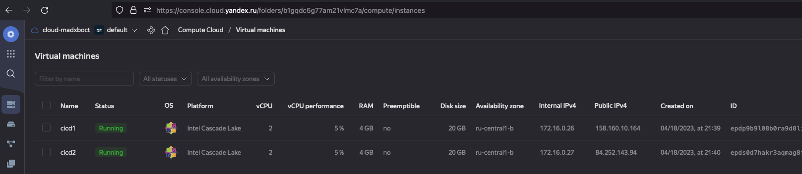
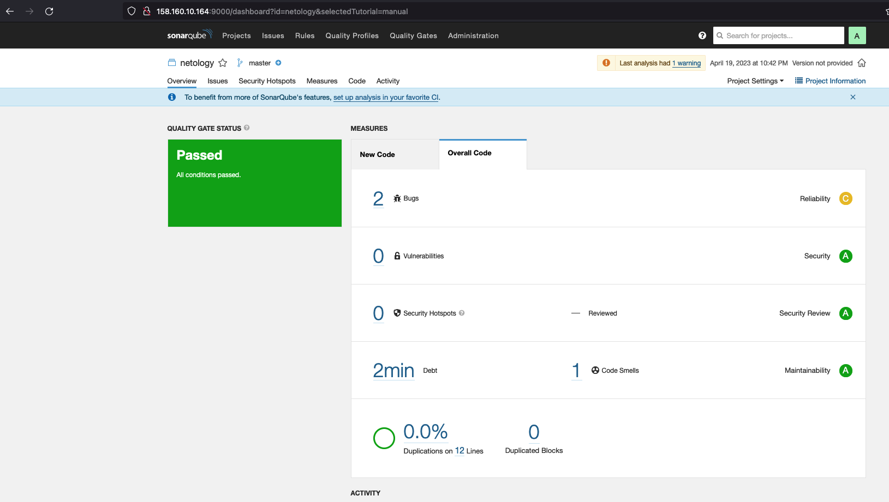

## Подготовка


```bash
➜  infrastructure git:(MNT-video) ✗ ansible-playbook -i inventory/cicd/hosts.yml site.yml 

PLAY [Get OpenJDK installed] ************************************************************************************************************************************************************************************************************************

TASK [Gathering Facts] ******************************************************************************************************************************************************************************************************************************
ok: [sonar-01]

TASK [install unzip] ********************************************************************************************************************************************************************************************************************************
changed: [sonar-01]

TASK [Upload .tar.gz file conaining binaries from remote storage] ***********************************************************************************************************************************************************************************
changed: [sonar-01]

TASK [Ensure installation dir exists] ***************************************************************************************************************************************************************************************************************
changed: [sonar-01]

TASK [Extract java in the installation directory] ***************************************************************************************************************************************************************************************************
changed: [sonar-01]

TASK [Export environment variables] *****************************************************************************************************************************************************************************************************************
changed: [sonar-01]

PLAY [Get PostgreSQL installed] *********************************************************************************************************************************************************************************************************************

TASK [Gathering Facts] ******************************************************************************************************************************************************************************************************************************
ok: [sonar-01]

TASK [Change repo file] *****************************************************************************************************************************************************************************************************************************
changed: [sonar-01]

TASK [Install PostgreSQL repos] *********************************************************************************************************************************************************************************************************************
changed: [sonar-01]

TASK [Install PostgreSQL] ***************************************************************************************************************************************************************************************************************************
changed: [sonar-01]

TASK [Init template1 DB] ****************************************************************************************************************************************************************************************************************************
changed: [sonar-01]

TASK [Start pgsql service] **************************************************************************************************************************************************************************************************************************
changed: [sonar-01]

TASK [Create user in system] ************************************************************************************************************************************************************************************************************************
changed: [sonar-01]

TASK [Create user for Sonar in PostgreSQL] **********************************************************************************************************************************************************************************************************
[WARNING]: Module remote_tmp /var/lib/pgsql/.ansible/tmp did not exist and was created with a mode of 0700, this may cause issues when running as another user. To avoid this, create the remote_tmp dir with the correct permissions manually
changed: [sonar-01]

TASK [Change password for Sonar user in PostgreSQL] *************************************************************************************************************************************************************************************************
changed: [sonar-01]

TASK [Create Sonar DB] ******************************************************************************************************************************************************************************************************************************
changed: [sonar-01]

TASK [Copy pg_hba.conf] *****************************************************************************************************************************************************************************************************************************
changed: [sonar-01]

PLAY [Prepare Sonar host] ***************************************************************************************************************************************************************************************************************************

TASK [Gathering Facts] ******************************************************************************************************************************************************************************************************************************
ok: [sonar-01]

TASK [Create group in system] ***********************************************************************************************************************************************************************************************************************
ok: [sonar-01]

TASK [Create user in system] ************************************************************************************************************************************************************************************************************************
ok: [sonar-01]

TASK [Set up ssh key to access for managed node] ****************************************************************************************************************************************************************************************************
changed: [sonar-01]

TASK [Allow group to have passwordless sudo] ********************************************************************************************************************************************************************************************************
changed: [sonar-01]

TASK [Increase Virtual Memory] **********************************************************************************************************************************************************************************************************************
changed: [sonar-01]

TASK [Reboot VM] ************************************************************************************************************************************************************************************************************************************
changed: [sonar-01]

PLAY [Get Sonarqube installed] **********************************************************************************************************************************************************************************************************************

TASK [Gathering Facts] ******************************************************************************************************************************************************************************************************************************
ok: [sonar-01]

TASK [Get distrib ZIP] ******************************************************************************************************************************************************************************************************************************
changed: [sonar-01]

TASK [Unzip Sonar] **********************************************************************************************************************************************************************************************************************************
changed: [sonar-01]

TASK [Move Sonar into place.] ***********************************************************************************************************************************************************************************************************************
changed: [sonar-01]

TASK [Configure SonarQube JDBC settings for PostgreSQL.] ********************************************************************************************************************************************************************************************
changed: [sonar-01] => (item={'regexp': '^sonar.jdbc.username', 'line': 'sonar.jdbc.username=sonar'})
changed: [sonar-01] => (item={'regexp': '^sonar.jdbc.password', 'line': 'sonar.jdbc.password=sonar'})
changed: [sonar-01] => (item={'regexp': '^sonar.jdbc.url', 'line': 'sonar.jdbc.url=jdbc:postgresql://localhost:5432/sonar?useUnicode=true&characterEncoding=utf8&rewriteBatchedStatements=true&useConfigs=maxPerformance'})
changed: [sonar-01] => (item={'regexp': '^sonar.web.context', 'line': 'sonar.web.context='})

TASK [Generate wrapper.conf] ************************************************************************************************************************************************************************************************************************
changed: [sonar-01]

TASK [Symlink sonar bin.] ***************************************************************************************************************************************************************************************************************************
changed: [sonar-01]

TASK [Copy SonarQube systemd unit file into place (for systemd systems).] ***************************************************************************************************************************************************************************
changed: [sonar-01]

TASK [Ensure Sonar is running and set to start on boot.] ********************************************************************************************************************************************************************************************
changed: [sonar-01]

TASK [Allow Sonar time to build on first start.] ****************************************************************************************************************************************************************************************************
Pausing for 180 seconds
(ctrl+C then 'C' = continue early, ctrl+C then 'A' = abort)
ok: [sonar-01]

TASK [Make sure Sonar is responding on the configured port.] ****************************************************************************************************************************************************************************************
ok: [sonar-01]

PLAY [Get Nexus installed] **************************************************************************************************************************************************************************************************************************

TASK [Gathering Facts] ******************************************************************************************************************************************************************************************************************************
ok: [nexus-01]

TASK [Create Nexus group] ***************************************************************************************************************************************************************************************************************************
changed: [nexus-01]

TASK [Create Nexus user] ****************************************************************************************************************************************************************************************************************************
changed: [nexus-01]

TASK [Install JDK] **********************************************************************************************************************************************************************************************************************************
changed: [nexus-01]

TASK [Create Nexus directories] *********************************************************************************************************************************************************************************************************************
changed: [nexus-01] => (item=/home/nexus/log)
changed: [nexus-01] => (item=/home/nexus/sonatype-work/nexus3)
changed: [nexus-01] => (item=/home/nexus/sonatype-work/nexus3/etc)
changed: [nexus-01] => (item=/home/nexus/pkg)
changed: [nexus-01] => (item=/home/nexus/tmp)

TASK [Download Nexus] *******************************************************************************************************************************************************************************************************************************
[WARNING]: Module remote_tmp /home/nexus/.ansible/tmp did not exist and was created with a mode of 0700, this may cause issues when running as another user. To avoid this, create the remote_tmp dir with the correct permissions manually
changed: [nexus-01]

TASK [Unpack Nexus] *********************************************************************************************************************************************************************************************************************************
changed: [nexus-01]

TASK [Link to Nexus Directory] **********************************************************************************************************************************************************************************************************************
changed: [nexus-01]

TASK [Add NEXUS_HOME for Nexus user] ****************************************************************************************************************************************************************************************************************
changed: [nexus-01]

TASK [Add run_as_user to Nexus.rc] ******************************************************************************************************************************************************************************************************************
changed: [nexus-01]

TASK [Raise nofile limit for Nexus user] ************************************************************************************************************************************************************************************************************
changed: [nexus-01]

TASK [Create Nexus service for SystemD] *************************************************************************************************************************************************************************************************************
changed: [nexus-01]

TASK [Ensure Nexus service is enabled for SystemD] **************************************************************************************************************************************************************************************************
changed: [nexus-01]

TASK [Create Nexus vmoptions] ***********************************************************************************************************************************************************************************************************************
changed: [nexus-01]

TASK [Create Nexus properties] **********************************************************************************************************************************************************************************************************************
changed: [nexus-01]

TASK [Lower Nexus disk space threshold] *************************************************************************************************************************************************************************************************************
skipping: [nexus-01]

TASK [Start Nexus service if enabled] ***************************************************************************************************************************************************************************************************************
changed: [nexus-01]

TASK [Ensure Nexus service is restarted] ************************************************************************************************************************************************************************************************************
skipping: [nexus-01]

TASK [Wait for Nexus port if started] ***************************************************************************************************************************************************************************************************************
ok: [nexus-01]

PLAY RECAP ******************************************************************************************************************************************************************************************************************************************
nexus-01                   : ok=17   changed=15   unreachable=0    failed=0    skipped=2    rescued=0    ignored=0   
sonar-01                   : ok=35   changed=27   unreachable=0    failed=0    skipped=0    rescued=0    ignored=0   
```

## Sonarqube
```bash
➜  example git:(MNT-video) ✗ sonar-scanner --version
INFO: Scanner configuration file: /Users/madxboct/Downloads/sonar-scanner-4.8.0.2856-macosx/conf/sonar-scanner.properties
INFO: Project root configuration file: NONE
INFO: SonarScanner 4.8.0.2856
INFO: Java 11.0.17 Eclipse Adoptium (64-bit)
INFO: Mac OS X 13.3.1 x86_64
➜  example git:(MNT-video) ✗ 
```



## Nexus
```bash
➜  mvn git:(MNT-video) ✗ mvn package                                                              
[INFO] Scanning for projects...
[INFO] 
[INFO] ---------------------------< netology:java >----------------------------
[INFO] Building java 8_282
[INFO]   from pom.xml
[INFO] --------------------------------[ jar ]---------------------------------
<...>
[INFO] Building jar: /Users/madxboct/Special/GitHub/mnt-homeworks/09-ci-03-cicd/mvn/target/java-8_282.jar
[INFO] ------------------------------------------------------------------------
[INFO] BUILD SUCCESS
[INFO] ------------------------------------------------------------------------
[INFO] Total time:  6.049 s
[INFO] Finished at: 2023-04-22T11:29:51+03:00
[INFO] ------------------------------------------------------------------------

/Users/madxboct/.m2/repository/netology/java/8_282
➜  8_282 pwd
➜  8_282 ll
total 24
-rw-r--r--  1 madxboct  staff   175B Apr 22 14:19 _remote.repositories
-rw-r--r--  1 madxboct  staff     0B Apr 22 14:19 java-8_282-distrib.tar.gz
-rw-r--r--  1 madxboct  staff    40B Apr 22 14:19 java-8_282-distrib.tar.gz.sha1
-rw-r--r--  1 madxboct  staff   390B Apr 22 14:19 java-8_282.pom.lastUpdated
➜  8_282 
```
