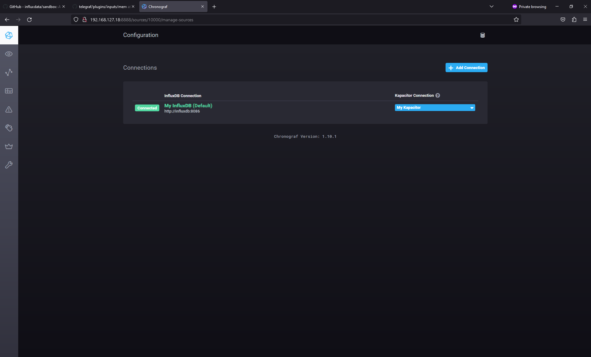
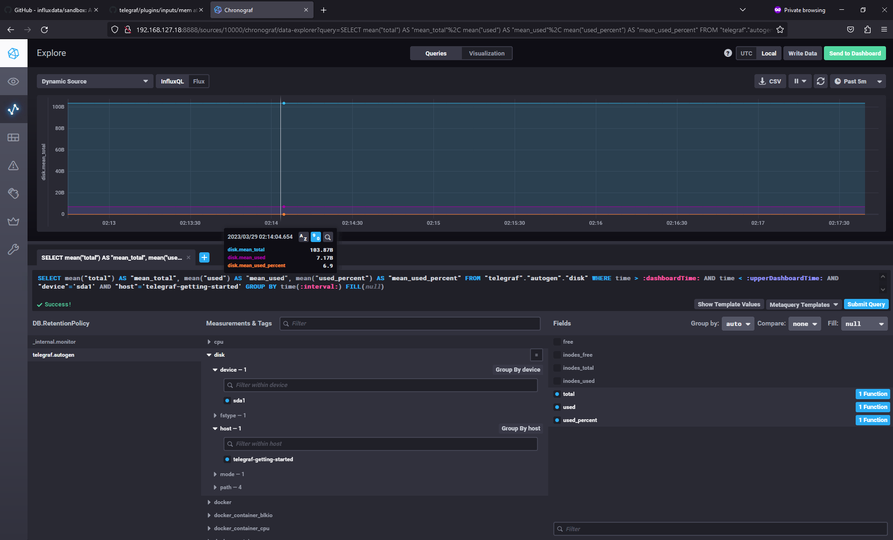
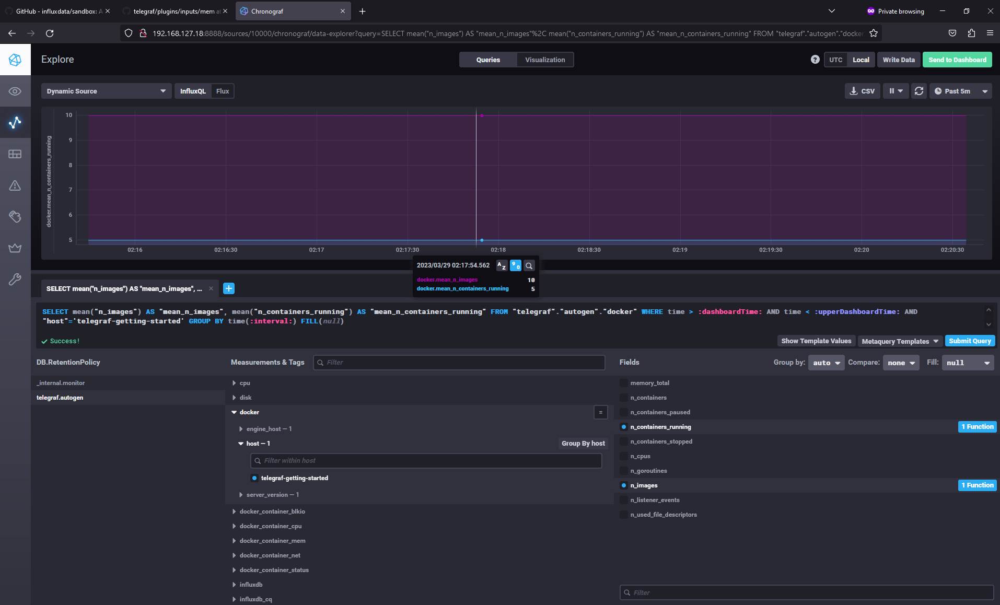

### Задание 1
- Доступность хоста с платформой, ping
- Доступность tcp\80 порта
- Доступность какой-нибудь страницы платформы по заданному URL (код ответа 200)
- Свободное место на диске, куда выгружаются отчеты
- Кол-во свободных inode
- Нагрузка на CPU (idle, system, user, LA 1/5/15)
- проверка кол-ва свободной памяти (RAM, swap)
- Нагрузка на сетевой интерфейс
- Если ПО работает в виде службы - проверка, что сервис/процесс запущен
- Проверка результата работы - появление новых файлов на диске

### Задание 2
RAM/inodes/CPUla - стандартные метрики Linux. Позволяют оценить доступность и быстродействие платформы.
Предложения:
- добавить метрики по времени формирования отчетов (минимальное, максимальное, среднее)
- метрика, отображающая кол-во отчетов сформировавшихся с ошибкой (совсем не сформироался или сформировался не до конца)
- Доступность приложения с привязкой ко времени (на основании отсуствия 5хх ошибок)

### Задание 3
- Расшарить разработчикам папки с логами, пусть читают. Так себе вариант. Если много серверов и пользователей процесс выдачи доступов будет трудоемким.
- Если есть возможность отщипнуть какое-то кол-во VM  от инфраструктуры - то тогда развернуть ELK стек, предоставить досуп в Кибану разработчикам.

### Задание 4
Коды ответов 3хх тоже надо учитывать.
`summ_2xx_requests+summ_3xx_requests/summ_all_requests`

### Задание 5
PUSH 
- удобна для использования в динамически создаваемых машинах (например контейнеры), так как в противном случае система мониторинга должна будет узнавать о новых хостах для их опроса.
- из минусов - все же придется "зашивать" в образ агент/конфиг с адресом сервера мониторинга

PULL 
-  контроль над метриками с единой точки, более высокий уровень контроля за источниками метрик, т.е. всегда известно кто,откуда и что передает. 
- возможность организовать сбор метрик без установки агента на целевой хост (как следствие не нужно следить за работоспособностью агентов и следить за версиями)
- неудобно в динамических средах (контейнеры)

### Задание 6

| Система         | Тип    |
|-----------------|--------|
| Prometheus      | Pull   |
| TICK            | Push   |
| Zabbix          | Гибрид |
| VictoriaMetrics | Push   |
| Nagios          | Pull   |

### Задание 7

### Задание 8

### Задание 9
