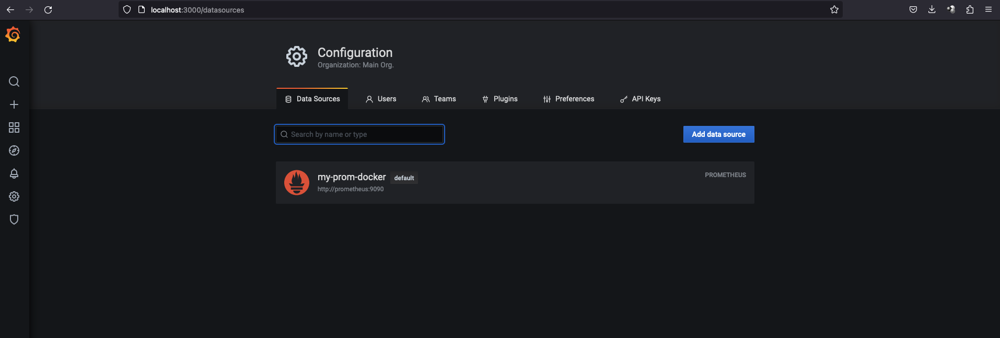
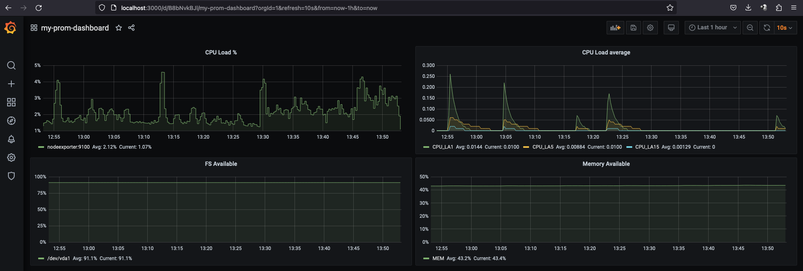

### Задание 1

### Задание 2
 - утилизация CPU для nodeexporter (в процентах, 100-idle) -> график CPU Load % \
`100 - (avg by (instance) (rate(node_cpu_seconds_total{job="nodeexporter",mode="idle"}[1m])) * 100)`
 - CPULA 1/5/15 -> график CPU Load average \
`node_load1`,`node_load5`,`node_load15`
 - количество свободной оперативной памяти -> график Memory Available\
`node_memory_Inactive_bytes/node_memory_MemAvailable_bytes*100`
 - количество места на файловой системе -> график FS Available \
`node_filesystem_avail_bytes{fstype!~"tmpfs"} / node_filesystem_size_bytes{fstype!~"tmpfs"}*100`

### Задание 3
### Задание 4
