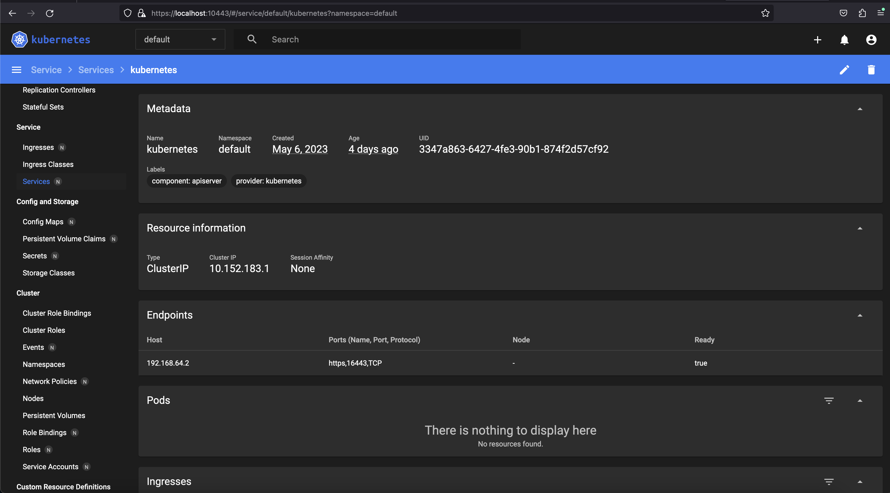

## MicroK8S install
```bash
➜  ~ brew install ubuntu/microk8s/microk8s
<...>
==> Tapping ubuntu/microk8s
Cloning into '/opt/homebrew/Library/Taps/ubuntu/homebrew-microk8s'...
<...>
==> Installing microk8s from ubuntu/microk8s
==> Installing dependencies for ubuntu/microk8s/microk8s: mpdecimal, ca-certificates, openssl@1.1, readline, sqlite, xz, python and kubernetes-cli
<...>
==> Caveats
==> microk8s
Run `microk8s install` to start with MicroK8s
➜  ~ microk8s status --wait-ready
microk8s is running
high-availability: no
  datastore master nodes: 127.0.0.1:19001
  datastore standby nodes: none
addons:
  enabled:
    ha-cluster           # (core) Configure high availability on the current node
    helm                 # (core) Helm - the package manager for Kubernetes
    helm3                # (core) Helm 3 - the package manager for Kubernetes
  disabled:
    cert-manager         # (core) Cloud native certificate management
    community            # (core) The community addons repository
    dashboard            # (core) The Kubernetes dashboard
    dns                  # (core) CoreDNS
    host-access          # (core) Allow Pods connecting to Host services smoothly
    hostpath-storage     # (core) Storage class; allocates storage from host directory
    ingress              # (core) Ingress controller for external access
    kube-ovn             # (core) An advanced network fabric for Kubernetes
    mayastor             # (core) OpenEBS MayaStor
    metallb              # (core) Loadbalancer for your Kubernetes cluster
    metrics-server       # (core) K8s Metrics Server for API access to service metrics
    minio                # (core) MinIO object storage
    observability        # (core) A lightweight observability stack for logs, traces and metrics
    prometheus           # (core) Prometheus operator for monitoring and logging
    rbac                 # (core) Role-Based Access Control for authorisation
    registry             # (core) Private image registry exposed on localhost:32000
    storage              # (core) Alias to hostpath-storage add-on, deprecated
```

### Dashboard
```bash
➜  ~ microk8s enable dashboard
Infer repository core for addon dashboard
Enabling Kubernetes Dashboard
Infer repository core for addon metrics-server
Enabling Metrics-Server
serviceaccount/metrics-server created
clusterrole.rbac.authorization.k8s.io/system:aggregated-metrics-reader created
clusterrole.rbac.authorization.k8s.io/system:metrics-server created
rolebinding.rbac.authorization.k8s.io/metrics-server-auth-reader created
clusterrolebinding.rbac.authorization.k8s.io/metrics-server:system:auth-delegator created
clusterrolebinding.rbac.authorization.k8s.io/system:metrics-server created
service/metrics-server created
deployment.apps/metrics-server created
apiservice.apiregistration.k8s.io/v1beta1.metrics.k8s.io created
clusterrolebinding.rbac.authorization.k8s.io/microk8s-admin created
Metrics-Server is enabled
Applying manifest
serviceaccount/kubernetes-dashboard created
service/kubernetes-dashboard created
secret/kubernetes-dashboard-certs created
secret/kubernetes-dashboard-csrf created
secret/kubernetes-dashboard-key-holder created
configmap/kubernetes-dashboard-settings created
role.rbac.authorization.k8s.io/kubernetes-dashboard created
clusterrole.rbac.authorization.k8s.io/kubernetes-dashboard created
rolebinding.rbac.authorization.k8s.io/kubernetes-dashboard created
clusterrolebinding.rbac.authorization.k8s.io/kubernetes-dashboard created
deployment.apps/kubernetes-dashboard created
service/dashboard-metrics-scraper created
deployment.apps/dashboard-metrics-scraper created
secret/microk8s-dashboard-token created

If RBAC is not enabled access the dashboard using the token retrieved with:

microk8s kubectl describe secret -n kube-system microk8s-dashboard-token

Use this token in the https login UI of the kubernetes-dashboard service.

In an RBAC enabled setup (microk8s enable RBAC) you need to create a user with restricted
permissions as shown in:
https://github.com/kubernetes/dashboard/blob/master/docs/user/access-control/creating-sample-user.md
```

## kubectl
```bash
➜  ~ brew install kubectl
==> Downloading https://formulae.brew.sh/api/formula.jws.json
############################################################################################################################################################################################################################################## 100.0%
Warning: kubernetes-cli 1.27.1 is already installed and up-to-date.
To reinstall 1.27.1, run:
  brew reinstall kubernetes-cli
➜  .kube microk8s config > config
➜  .kube kubectl get nodes
NAME          STATUS   ROLES    AGE    VERSION
microk8s-vm   Ready    <none>   4d3h   v1.26.4
➜  ~ kubectl port-forward -n kube-system service/kubernetes-dashboard 10443:443
Forwarding from 127.0.0.1:10443 -> 8443
Forwarding from [::1]:10443 -> 8443
```

